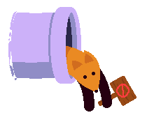

# NoPipeline

By default, Monogame uses Pipeline Tool to manage and build resources. Usually you don't add resources directly -- you build them first at compilation, and then load built resources at runtime. It's an ok concept, but Pipeline Tool is a huge hassle to work with. It cannot track resources by itself, you have to open it and add resources by hand every time. Before proceeding, I recommend reading this [article](http://www.monogame.net/documentation/?page=Using_The_Pipeline_Tool) to learn how Pipeline Tool works...

...and why we need NoPipeline! 



NoPipeline is an addon for Pipeline Tool, which generates and updates `.mgcb` config for you. You can safely add, delete and move around resource files right in the Explorer - NoPipeline will do the rest for you.

Additionally, you can make resource files watch other files! Let's say, you got Tiled map project. It has one main `.tmx` file and a bunch of textures and tileset files. But Pipeline Tool has referenced only `.tmx` file, so if you
update only texture or only tileset, you have to either update the `.tmx` or do a manual rebuild, because Pipeline Tool doesn't know about files other than `.tmx`. 

With NoPipeline you don't have to do any of that - just set `.tmx` file to watch textures and tilesets - and Pipeline Tool will detect and update everything by itself.

## But how does NoPipeline know what resources go where?

NoPipeline uses NPL config. It's used to generate MGCB config. Inside it looks like this:

```json
{
	"content": 
	{
		"textures": 
		{
			"path": "Textures/*.png",
			"recursive": "True",
			"action": "build",
			"importer": "TextureImporter",
			"processor": "TextureProcessor",
			"processorParam": 
			{
				"ColorKeyColor": "255,0,255,255",
				"ColorKeyEnabled": "True",
				"GenerateMipmaps": "False",
				"PremultiplyAlpha": "True",
				"ResizeToPowerOfTwo": "False",
				"MakeSquare": "False",
				"TextureFormat": "Color",
			}
		},
		"specificFile": 
		{
			"path": "Path/To/File/specificFile.txt",
			"recursive": "False",
			"action": "copy",
		}
	}
}
```

NPL config is essentially a JSON. Config above has two file groups: `textures` 
and `specificFile`. Each file group describes one specific resource type. 
File groups can contain whole directories or single files.

Let's look at an each parameter:

- `path` is a path to the resource files relative to the main Content folder. 
  Here are some examples:
  - `Graphics/Textures/texture.png` will grab only `texture.png` file.
  - `Graphics/Textures/*.png` will grab any `.png` file.
  - `Graphics/Textures/*` will grab any file in the `Textures` directory.
- `recursive` tells NoPipeline to include resource files from subdirectories.
  For example, if set to `True`, and the `path` is `Graphics/Textures/*.png`,
  files from `Graphics/Textures/Subdir/` will be grabbed as well. If set to 
  `False`, they will be ignored.
- `action` tells what action has to be done for this file group. Can be `build`
  or `copy`.
- `importer` tells what importer should be used for building.
- `processor` tells what processor should be used for building.
- `processorParam` is an optional list of processor parameters, if resource 
  has any.

There is also an optional `watch` parameter. Its usage looks like this:

```json
{
  "content": 
  {
    "spriteGroup": 
    {
      "path": "Graphics/*.spritegroup",
      "recursive": "True",
      "action": "build",
      "importer": "SpriteGroupImporter",
      "processor": "SpriteGroupProcessor",
      "watch": 
      [
        "Default/*.png",
        "Default/*.json",
      ]
    },
  }
}
```

With `watch` parameter present, all the `.spritegoup` files will be built
by Pipeline Tool, if any `.png` or `.json` file will be changed. Note that
all the paths listed in `watch` are relative to the main `path`, so final paths 
will look like this: `Graphics/Default/*.png`.

Monofoxe projects have NPL config set up out of the box. It already has all the basic resource types, but you can add your own in there, if you'd like.

For additional information, check out [NoPipeline repository](https://github.com/gnFur/NoPipeline).

**NOTE:** NoPipeline is required for Monofoxe to work.

## | [Adding resources >>](AddingResources.md) 

[<<< Contents](../Contents.md)